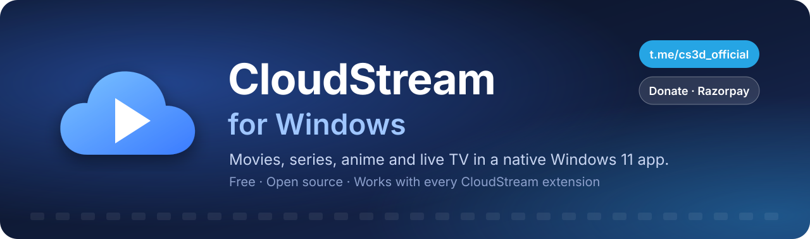
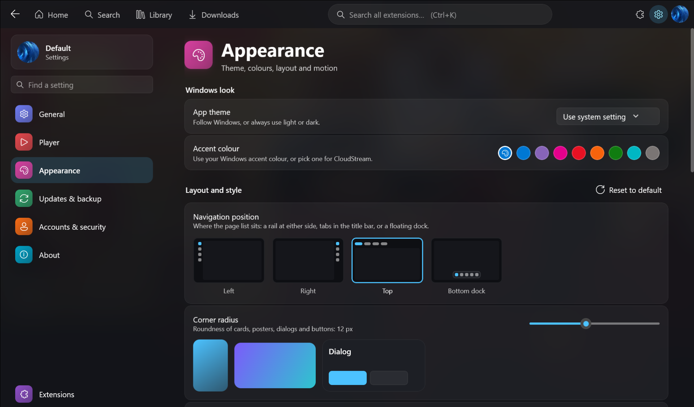
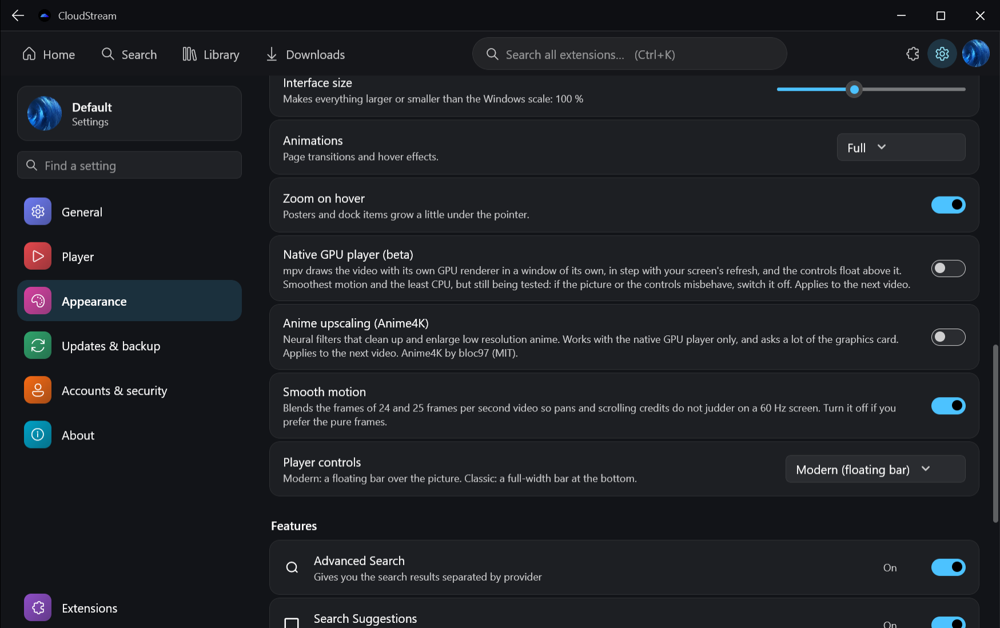
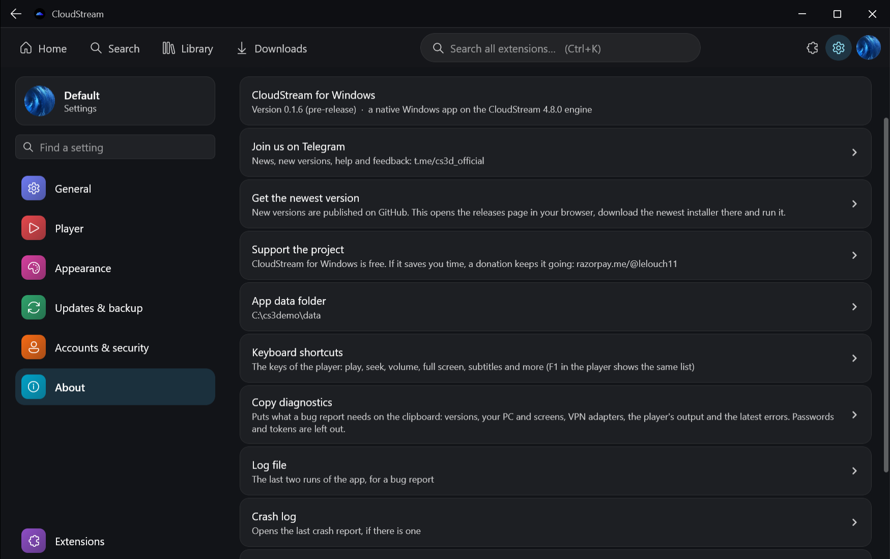

<p align="center">
  
</p>

<h3 align="center">Movies, series, anime and live TV on your PC, in a real Windows 11 app.</h3>

<p align="center">
  <a href="https://t.me/cs3d_official"></a>
  <a href="https://razorpay.me/@lelouch11"></a>
  <a href="../../releases"></a>
</p>

<p align="center">
  
  
  
  
</p>

<p align="center">
  <a href="#-join-the-telegram-channel">Telegram</a> ·
  <a href="#-download">Download</a> ·
  <a href="#-screenshots">Screenshots</a> ·
  <a href="#-what-you-get">Features</a> ·
  <a href="#-first-steps">First steps</a> ·
  <a href="#-help-and-fixes">Help</a> ·
  <a href="#-support-the-project">Donate</a>
</p>

---

## 📣 Join the Telegram channel

<table>
<tr>
<td width="72%">

**[t.me/cs3d_official](https://t.me/cs3d_official) is the home of this app.** Everything happens there first:

- 🆕 **New versions are announced there.** The app does not update itself behind your back, so the channel is how you hear about a new build and what it fixes.
- 🛠️ **Fixes and workarounds** when a source or a live channel stops working.
- 💬 **Questions, bug reports and ideas.** Say what you did and what happened; it is read.

</td>
<td align="center" width="28%">

<a href="https://t.me/cs3d_official"></a>

</td>
</tr>
</table>

---

## ⬇️ Download

1. Open **[Releases](../../releases)** and download the newest `CloudStream-…-windows-x64.msi`.
2. Run it. It installs just for you, no administrator rights needed.
3. Open **CloudStream** from the Start menu.

Windows 10 or 11, 64-bit. Windows SmartScreen may ask for confirmation because the installer is not code-signed yet: choose *More info → Run anyway*.

**Updating:** download the newest MSI from [Releases](../../releases) and run it over the old one. Your settings, accounts and extensions are kept. (Settings → About → *Get the newest version* opens the same page.) Follow the [Telegram channel](https://t.me/cs3d_official) to know when there is one.

> **Pre-release.** The app is new and still gets updates often. If something is wrong, tell us on [Telegram](https://t.me/cs3d_official).

---

## 🖼️ Screenshots

<p align="center">
  
  <br><sub>The player (video: <i>Big Buck Bunny</i> © Blender Foundation, CC BY 3.0).</sub>
</p>
<p align="center">
  
  
</p>
<p align="center">
  
</p>

---

## ✨ What you get

| | |
|---|---|
| 🎬 **A player built for the desktop** | Built on mpv: HLS and DASH, hardware decoding, audio and video track menus, picture in picture, resume where you stopped. |
| 🚀 **Native GPU player (beta)** | Switch it on in Settings → Appearance: mpv draws the video with its own GPU renderer in a window of its own, timed to your screen, with the controls floating above. The smoothest picture and the least CPU; it falls back to the standard player by itself if it cannot start. |
| 🧈 **Smooth motion** | 24 and 25 fps films judder on a 60 Hz screen (the picture jumps between two and three refreshes per frame). *Smooth motion* blends the frames around each refresh so pans and credits glide. On by default, switch it off in Settings → Appearance. |
| 📺 **Live TV** | Live channels, including ClearKey-protected DASH streams with many audio languages, with a *Go live* button after you skip ahead. |
| 💬 **Subtitles that work** | Embedded tracks, files, and online search (OpenSubtitles, SubDL, Subtitle Cat and others), one style for all of them: font, size, colours, shadow, position. |
| 🧩 **Every CloudStream extension** | It runs on the CloudStream engine, so the extensions and repositories you know work here. You add them; the app ships with none. |
| 🎨 **Make it yours** | Menu on the top, left, right or bottom; corner roundness, poster size, spacing, backdrop, interface size, animations. |
| 🔗 **Your lists, synced** | AniList, MyAnimeList and Simkl: progress and lists follow you (you register a free API client of your own, the app explains the three steps). |
| 🪟 **Looks like Windows 11** | Fluent design, one calm start-up screen, one title bar that hides when maximized. |
| ▶️ **Your player if you prefer** | Open any link in **VLC** or your browser instead (Settings → Player → Preferred video player). |

---

## 🚀 First steps

1. **Add an extension repository** (Extensions page). The app comes with none, exactly like CloudStream.
2. Search or browse, open a title and press **Play**.
3. *Optional:* sign in to AniList, MyAnimeList or Simkl (Settings → Accounts & security) to sync your list and progress.

---

## 🩺 Help and fixes

<details>
<summary><b>The video stutters or judders</b></summary>

- Settings → Appearance → make sure **Smooth motion** is on (it is by default), and try **Native GPU player (beta)**: mpv's own GPU renderer is the smoothest option.
- Windows: set the power mode to *Balanced* or *Best performance*, and keep your graphics driver current.
- On a 4K or very large screen the picture is drawn a little smaller than the window and enlarged by the graphics card; that is on purpose, it keeps playback smooth.
- Still not right? Tell us on [Telegram](https://t.me/cs3d_official): which source, what video, and what PC.

</details>

<details>
<summary><b>A live channel or a source does not play (works on my phone)</b></summary>

Some sources only answer a normal home connection and refuse VPNs, proxies and Cloudflare WARP (they send back a different page or an error). If a channel works on your phone but not on the PC, **turn the VPN / WARP off and try again.** If it still fails, tell us on [Telegram](https://t.me/cs3d_official) with the channel's name.

</details>

<details>
<summary><b>Windows says "Windows protected your PC"</b></summary>

The installer is not code-signed yet. Choose *More info → Run anyway*. The source code is in this repository and the installer is built from it.

</details>

<details>
<summary><b>How do I update?</b></summary>

Download the newest installer from [Releases](../../releases) and run it. The channel at [t.me/cs3d_official](https://t.me/cs3d_official) announces every new version.

</details>

<details>
<summary><b>Where are my settings?</b></summary>

In `%APPDATA%\CloudStream` (Settings → About → *App data folder* opens it). Back them up with Settings → Updates & backup → *Back up data*.

</details>

**Report a bug:** [Telegram](https://t.me/cs3d_official) or [GitHub issues](../../issues). Say what you did and what happened, and paste **Settings → About → Copy diagnostics** (your PC, screens, player output and the latest errors; passwords and tokens are masked). A crash log, if there is one, is under *Crash log* on the same page.

---

## 💙 Support the project

CloudStream for Windows is **free** and has no ads. It is made in spare time. If it saves you time or you simply enjoy it, a donation helps keep it alive and growing.

<p align="center">
  <a href="https://razorpay.me/@lelouch11"></a>
  &nbsp;
  <a href="https://t.me/cs3d_official"></a>
</p>
<p align="center"><sub><a href="https://razorpay.me/@lelouch11">razorpay.me/@lelouch11</a> · every amount counts, and so does telling a friend.</sub></p>

---

## 📜 About content

The app contains **no extensions and no content**. Extensions are made by other people and added by you; you are responsible for what you use them for.

<details>
<summary>For developers</summary>

You need JDK 21 and [Git LFS](https://git-lfs.com) (run `git lfs install` before cloning; the bundled mpv library is stored with it).

```
./gradlew :app:runDev           # run from source
./gradlew :app:portableDist     # portable folder in dist/CloudStream-Portable
./gradlew :app:installerMsi     # installer in dist/release (needs the WiX Toolset 3.x on PATH)
./gradlew :app:test
```

AniList, MyAnimeList and Simkl need an API client of your own: register one on each service and paste its ID in Settings → Accounts & security → Sign-in keys (the dialog shows the redirect address to use). Builds can also take them from `local.properties` (`anilist.key`, `mal.key`, `simkl.id`, `simkl.secret`) or the environment.

| Folder | What it is |
| --- | --- |
| `app` | The desktop app: interface, player, packaging |
| `android` | The Android APIs that CloudStream and its extensions use, built for the desktop JVM |
| `library`, `shared` | CloudStream's plugin API, extractors and shared UI (upstream sources) |
| `tools` | Developer tools |
| `docs/PLAN.md` | Architecture, decisions, test notes |
| `docs/IMPROVEMENT_PLAN.md` | What is next: measured findings and the roadmap |

</details>

<p align="center"><sub>Licensed under GPL-3.0, like CloudStream. Built on the <a href="https://github.com/recloudstream/cloudstream">CloudStream</a> engine.</sub></p>
